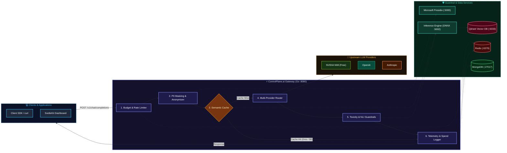

# 🌐 ControlPlane.ai

<div align="center">


**An enterprise-grade, ultra-low-latency AI Control Plane & LLM Gateway with built-in semantic caching, guardrails (PII redaction, toxicity scanning, hallucination verification), cost budgeting, and full-stack observability.**

[Features](#-key-features) • [Architecture](#-architecture) • [Quick Start](#-quick-start) • [API Reference](#-api-reference) • [Demo](#-gateway-demo)

</div>

---

## 📽️ Gateway Demo

<!-- HERO GIF: Add your terminal / API demo GIF here -->
<div align="center">
  
  <p><em>Real-time OpenAI-compatible proxy with sub-millisecond semantic cache hit, PII masking, and cost tracking</em></p>
</div>

---

## ✨ Key Features

- **⚡ Semantic Caching**: Powered by **Qdrant** and local ONNX embeddings (`bge-small-en-v1.5`), cutting LLM inference costs and delivering instant sub-millisecond responses for semantically similar prompts.
- **🛡️ AI Safety & Guardrails**:
  - **PII Detection & Anonymization**: Automatic masking of sensitive personal information via **Microsoft Presidio**.
  - **Toxicity & Moderation Scanner**: Multi-label toxicity scoring (`severe_toxicity`, `obscene`, `threat`, `insult`, `identity_attack`) via ONNX runtime.
  - **NLI Hallucination Verification**: Natural Language Inference entailment checks between context and model responses.
  - **Confidence Scoring**: Logprob-based confidence analytics.
- **💰 Cost Management & Budget Caps**:
  - Per-user daily & monthly budget enforcement backed by **Redis**.
  - Token-level and microcent-level cost tracking with cumulative savings calculation.
- **🔄 Multi-Provider OpenAI-Compatible Gateway**:
  - Drop-in `/v1/chat/completions` proxy supporting multiple downstream LLM providers.
- **📊 Comprehensive Observability & Playground**:
  - MongoDB-backed audit log capturing prompt, response, latency, token spend, toxicity, and NLI verification scores.
  - Interactive playground endpoint (`/v1/playground`) and web UI built with **SvelteKit** and **Tailwind CSS**.

---

## 🏛️ Architecture



---

## 🖥️ Web Dashboard

<!-- DASHBOARD GIF: Add your web dashboard walkthrough GIF here -->
<div align="center">
  
  <p><em>SvelteKit Web Dashboard for real-time request tracing, safety telemetry, and budget configuration</em></p>
</div>

---

## 🚀 Quick Start

### Prerequisites

- [Docker](https://docs.docker.com/get-docker/) and [Docker Compose](https://docs.docker.com/compose/)
- [Go](https://go.dev/dl/) 1.22+ (for local backend development)
- [uv](https://docs.astral.sh/uv/) (for local Python inference development)
- [Bun](https://bun.sh/) or [Node.js](https://nodejs.org/) (for Web UI)

### 1. Clone & Start Infrastructure

```bash
# Clone the repository
git clone https://github.com/AMythicDev/controlplane.ai.git
cd controlplane.ai

# Start all supporting microservices (Redis, Mongo, Qdrant, Presidio, Inference)
docker compose up -d
```

### 2. Configure Environment

Create a `.env` file in `backend/`:

```env
PORT=8080
REDIS_URL=localhost:6379
REDIS_DB=0
MONGO_URI=mongodb://localhost:27017
INFERENCE_API_URL=http://localhost:5002
PRESIDIO_ANALYZER_URL=http://localhost:5000
PRESIDIO_ANONYMIZER_URL=http://localhost:5001
NVIDIA_API_KEY=nvapi-your-key-here
```

### 3. Run the Gateway

```bash
cd backend
go run main.go
```

### 4. Run the Web Dashboard

```bash
cd ../web
bun install
bun run dev
```

---

## 📡 API Reference

### 1. Chat Completions (OpenAI Compatible)

`POST /v1/chat/completions`

```bash
curl -X POST http://localhost:8080/v1/chat/completions \
  -H "Content-Type: application/json" \
  -d '{
    "model": "openai/gpt-4o-mini",
    "use_semantic_cache": true,
    "messages": [
      {
        "role": "user",
        "content": "Explain quantum computing in simple terms."
      }
    ]
  }'
```

**Response:**
```json
{
  "id": "chatcmpl-openai",
  "object": "chat.completion",
  "model": "openai/gpt-4o-mini",
  "confidence": 0.98,
  "toxicity": 0.001,
  "nli": {
    "entailment": 0.94,
    "neutral": 0.05,
    "contradiction": 0.01
  },
  "choices": [
    {
      "index": 0,
      "message": {
        "role": "assistant",
        "content": "Quantum computing is a type of computing that uses quantum mechanics..."
      },
      "finish_reason": "stop"
    }
  ]
}
```

### 2. Cost & Cache Savings Analytics

`GET /v1/cost`

```json
{
  "user_id": "user_mvp_123",
  "cost_dollars": 0.0245,
  "savings_dollars": 0.1850,
  "total_savings": 0.1850,
  "average_cost_dollars": 0.0012
}
```

### 3. Budget Configuration

`GET /v1/config` | `POST /v1/config`

```json
{
  "per_user_daily_limit": 5000000,
  "per_user_monthly_limit": 150000000
}
```

### 4. Request Audit Logs

`GET /v1/requests?limit=20&offset=0`

Returns paginated request histories with full telemetry (prompt, masked PII, latency, confidence, toxicity scores, cache hit flags).

---

## 🛠️ Repository Structure

```
.
├── backend/               # Core AI Gateway in Go (Gin, Redis, MongoDB, Presidio)
│   ├── pii-detection/     # Custom Presidio recognizers and redaction logic
│   ├── cost-tracking.go   # Budget control & Redis spend accounting
│   ├── semantic-cache.go  # Qdrant cache query & persist handlers
│   ├── toxicity-scanner.go# Toxicity validation client
│   └── request-log.go     # MongoDB request auditing
├── inference/             # ML inference engine (FastAPI, ONNX Runtime, Qdrant)
│   ├── src/               # Toxicity models, NLI verifier, embeddings
│   └── Dockerfile         # Containerized inference service
├── web/                   # Frontend observability dashboard (SvelteKit 5, Tailwind CSS)
├── docker-compose.yaml    # Microservices orchestration (Redis, Mongo, Qdrant, Presidio)
└── assets/                # README demos, GIFs, and architecture diagrams
```

---

## 🤝 Contributing

Contributions, issues, and feature requests are welcome! Feel free to check the [issues page](https://github.com/AMythicDev/controlplane.ai/issues).

---

## 📄 License

This project is licensed under the MIT License - see the [LICENSE](LICENSE) file for details.
