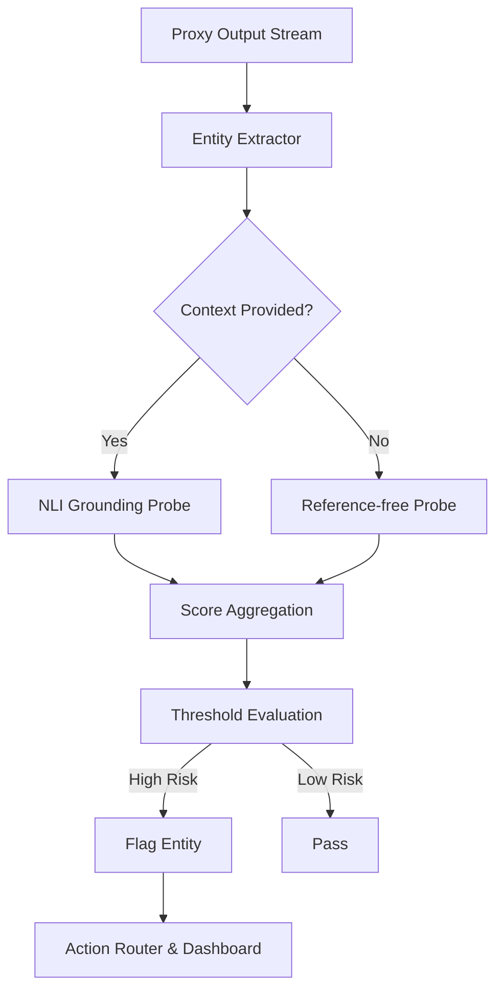

---
tags:
  - performance-engine
  - feature
related:
  - "[[Product Document]]"
  - "[[Confidence Scoring]]"
  - "[[Citation Verification]]"
priority: should-ship
engine: Performance Engine
---

# Hallucination Detection

## Overview

Hallucination Detection is a critical Layer 3 component of the ControlPlane.ai Performance Engine. While Layer 2 ([[Confidence Scoring]]) uses statistical heuristics, Layer 3 employs lightweight classifier probes to explicitly flag entity-level hallucinations—fabricated names, dates, numbers, and URLs. 

The goal is to catch plausible-sounding but factually incorrect statements. Because deep LLM-as-judge evaluation is too slow for inline use, this feature relies on a fast, specialized probe model (e.g., an optimized DeBERTa-v3 or a distilled HHEM model) running in ~20ms. When reference data (like RAG context) is available, the probe performs NLI (Natural Language Inference) to ensure the generated entities are grounded in the source.

## Technical Approach

### 1. Entity Extraction
We first extract high-risk entities from the incoming LLM response stream using a fast NER (Named Entity Recognition) model or regex patterns for structured data (URLs, dates).
- Focus areas: `PERSON`, `ORG`, `DATE`, `MONEY`, `URL`.

### 2. The Hallucination Probe
We deploy a lightweight, ONNX-optimized classifier. Two modes of operation:
- **Reference-Free (Zero-Context)**: Uses a model trained to detect semantic anomalies and typical hallucination patterns (e.g., using the Hughes Hallucination Evaluation Model - HHEM approach).
- **Reference-Based (RAG)**: If the prompt includes context, we run an NLI model (e.g., DeBERTa-v3-small-mnli) treating the context as the *premise* and the sentence containing the entity as the *hypothesis*. If the relationship is not "entailment", it's flagged.

### 3. Activation Analysis (Future)
If we have access to white-box model activations (not available for OpenAI, but applicable for locally hosted vLLM instances), we can train linear probes directly on the hidden states to detect the model's internal representation of truthfulness.

### 4. Integration with Semantic Entropy
We combine the probe's output with the logprob-based entropy from [[Confidence Scoring]]. A high-entropy entity combined with a low-entailment score from the NLI probe yields a near-certain hallucination flag.

## Data Flow

## Implementation Steps

1. **Model Selection**: Evaluate and select the fastest viable NLI model (e.g., `cross-encoder/nli-deberta-v3-small`).
2. **ONNX Export & Quantization**: Convert the model to ONNX format and apply INT8 quantization to meet the 20ms latency budget.
3. **Inference Server setup**: Deploy the probe using Triton Inference Server or ONNX Runtime directly within the FastAPI worker.
4. **Entity Extraction Logic**: Implement a fast SpaCy pipeline or regex-based heuristic for entity extraction.
5. **Streaming Integration**: Run the probe asynchronously on sentence boundaries as the stream flows through the proxy.
6. **Alerting Mechanism**: Format the hallucination flags and inject them into the WebSocket stream for the UI.

## Key Technical Decisions

### Sentence-level vs Entity-level
**Decision:** Entity-level evaluation.
**Rationale:** Evaluating entire paragraphs is too slow. By extracting specific entities and evaluating only the clauses containing them, we drastically reduce the compute payload and meet our 20ms latency goal.

### Handling Streaming Text
**Decision:** Sentence-boundary execution.
**Rationale:** NLI requires complete thoughts. We buffer the streaming tokens until a sentence boundary (., !, ?) is reached, then asynchronously fire the probe while the proxy continues streaming the next sentence.

## Edge Cases & Challenges

- **Latency Spikes**: Cold starts or concurrent requests can push inference past 20ms. We must implement strict timeouts; if the probe takes >25ms, we fail open and pass the traffic.
- **False Positives**: The NLI model might flag valid paraphrasing as a contradiction or neutral. We need a tunable threshold for the entailment score.
- **Context Window Limits**: For RAG, the reference text might be 100k tokens. A small DeBERTa model cannot process this. We must use a fast BM25 retrieval step *within* the probe to find the relevant context snippet before running NLI.

## Integration Points

- **[[Citation Verification]]**: Works hand-in-hand to verify that entities are not just grounded, but properly cited.
- **[[Factual Drift Monitor]]**: The inline probe catches obvious errors; the async monitor catches complex logical failures.
- **Dashboard**: Highlights hallucinated entities in yellow/red depending on the severity.

## Success Metrics

- **Latency**: P95 latency < 20ms for sentences < 30 words.
- **Precision/Recall**: Precision > 85% on RAG hallucination benchmark (e.g., TRUE dataset).
- **Throughput**: Support 500 concurrent checks per GPU node.

## References

- Hughes Hallucination Evaluation Model (HHEM)
- SelfCheckGPT: Zero-Resource Black-Box Hallucination Detection
- TRUE: Evaluating Factual Consistency in Knowledge-Grounded Text Generation
